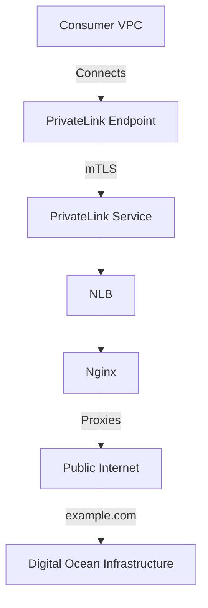

# AWS Privatelink VPC Endpoint Vulnerability


This repository contains Terraform configuration files for setting up an AWS Consumer/Producer VPC with Nginx exposed via PrivateLink service and endpoints.

## Key Features

- **Nginx Server Configuration**: The Nginx server responds with a custom JNDI packet and can also be used to reverse proxy connectivity to public internet destinations.
- **Security Demonstrations**:
  - Prove that AWS PrivateLink service does not support in-line threat prevention capabilities.
  - Demonstrate how AWS PrivateLink can be used to create external public connectivity outside of AWS.

## Architecture Overview

The architecture involves:
- **Consumer VPC**: Contains an EC2 instance that connects to the PrivateLink endpoint.
- **Producer VPC**: Hosts the Nginx server behind a Network Load Balancer (NLB), exposed via the PrivateLink service.
- **Digital Ocean Infrastructure**: An external setup (not included in this repository) that interacts with the AWS infrastructure for demonstration purposes.

## Prerequisites

- Terraform installed on your local machine.
- AWS credentials configured.
  - I use powershell in VSC. 
      ```
      $env:AWS_ACCESS_KEY_ID = "AKIAYYRXXX696969"
      $env:AWS_SECRET_ACCESS_KEY = "FAKEAWSSECRETACCESSKEYEXAMPLE"
      ```

## Usage

1. Clone the repository.
2. Modify the variables in `terraform.tfvars` to match your environment.
3. Run `terraform init` to initialize the configuration.
4. Run `terraform apply` to apply the configuration.

## Diagram



### Explanation

1. **Consumer VPC**: The EC2 instance connects to the PrivateLink endpoint.
2. **PrivateLink Endpoint**: Connects the consumer VPC to the producer VPC's PrivateLink service.
3. **PrivateLink Service**: Exposes the Nginx server via an NLB.
4. **NLB**: Distributes traffic to the Nginx server in the producer VPC.
5. **Nginx**: Acts as a reverse proxy and responds with custom JNDI packets.
6. **Public Internet**: Nginx can proxy requests to external destinations like `example.com`.
7. **Digital Ocean Infrastructure**: Demonstrates external interactions (not included in this repo).

### Conclusion

This setup highlights potential vulnerabilities and misconfigurations in using AWS PrivateLink for exposing internal services to the internet, showcasing the need for robust security measures.

