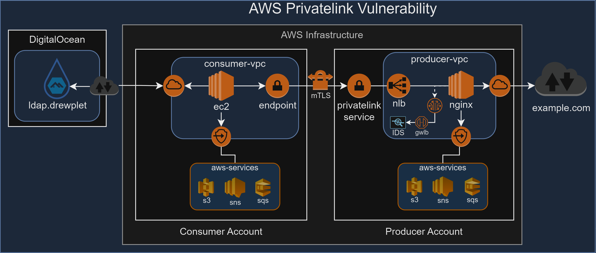

# AWS Privatelink VPC Endpoint Vulnerability
- [AWS Privatelink VPC Endpoint Vulnerability](#aws-privatelink-vpc-endpoint-vulnerability)
  - [Key Features](#key-features)
  - [Architecture Overview](#architecture-overview)
  - [Project Structure](#project-structure)
  - [Prerequisites](#prerequisites)
  - [Usage](#usage)
  - [Vulnerability Patterns (WIP)](#vulnerability-patterns-wip)
  - [Prevent, React, Detect Patterns (WIP)](#prevent-react-detect-patterns-wip)
  - [Videos](#videos)
    - [Terraform Apply](#terraform-apply)
    - [Jndi](#jndi)
    - [Internet Access](#internet-access)
    - [Struts](#struts)
    - [Malicious Messages](#malicious-messages)
    - [Insider Threats](#insider-threats)
    - [Malicious File](#malicious-file)
- [Conclusion](#conclusion)



This repository contains Terraform configuration files for setting up a AWS Consumer/Producer VPC with various privatelink services and vulnerability tests. 

## Key Features

- **Security Demonstrations**:
  - Prove that AWS PrivateLink service does not support in-line threat prevention capabilities.
  - Demonstrate how AWS PrivateLink can be used to create external public connectivity outside of AWS.
  - Create preventative, reactive and detective solutions architecture. 

# Project Structure
```
aws-privatelink-vuln/
├── img/
├── scripts/
│   ├── ...                     # Directory for shell scripts used in the project.
├── tpl/
│   ├── ...                     # Directory for Terraform template files used in the project.
├── ec2.tf                      # Terraform configuration file for defining EC2 instances and related resources.
├── elb.tf                      # Terraform configuration file for defining Elastic Load Balancers and related resources.
├── iam.tf                      # Terraform configuration file for defining IAM roles, policies, and profiles.
├── privatelink.tf              # Terraform configuration file for defining AWS PrivateLink endpoints and related resources.
├── sg.tf                       # Terraform configuration file for defining security groups and their rules.
├── terraform.tfvars            # Terraform variables file for defining input variables and their values.
├── variables.tf                # Terraform configuration file for defining variable declarations.
├── vpc.tf                      # Terraform configuration file for defining VPC, subnets, and related networking resources.
├── README.md                   # Markdown file for documenting the project, including descriptions of files and usage.
```

## Prerequisites

- Terraform installed on your local machine.
- Two separate AWS accounts with appropriate roles to create resources. 
- AWS credentials configured. (If running locally)
  - If you use powershell
      ```
      $env:TF_VAR_producer_access_key = "AKIAYYRXXX696969"
      $env:TF_VAR_producer_secret_key = "FAKEAWSSECRETACCESSKEYEXAMPLE"
      $env:TF_VAR_producer_access_key = "AKIAYYRYYY696969"
      $env:TF_VAR_producer_secret_key = "FAKEAWSSECRETACCESSKEYEXAMPLE"
      ```
  - If you use linux shell
      ```
      export TF_VAR_producer_access_key="AKIAYYRXXX696969"
      export TF_VAR_producer_secret_key="FAKEAWSSECRETACCESSKEYEXAMPLE"
      export TF_VAR_consumer_access_key="AKIAYYRYYY696969"
      export TF_VAR_consumer_secret_key="FAKEAWSSECRETACCESSKEYEXAMPLE"
      ```

## Usage

1. Clone the repository.
2. Modify the variables in `terraform.tfvars` to match your environment.
3. Run `terraform init` to initialize the configuration.
4. Run `terraform apply` to apply the configuration.


## Vulnerability Patterns (WIP)
1. **Consumer Vulnerability through Privatelink**
    - Log4j JNDI exploit
    - Internet Exfil/Infil
2. **Vulnerabilities through AWS Services**
    - Malicious File (s3)
    - Malicious Messages (sqs/sns)
3. **Privatelink Producer Vulnerability**
    - Struts RCE

## Prevent, React, Detect Patterns (WIP)
1. **Hardened API Gateway** 
2. **Inline IPS**
3. **Tapped IDS**
    
4. **Host-based NIDS/NIPS**
5. **Guard Duty**
6. **Host-based AV**
7. **Host-based Firewall**
8. **Hypervisor Firewall**
9. **DNS Security**
10. **IAM Policy**
11. **Hardened Pipeline**
12. **File Scanning**
13. **Alerting**

<!-- ## Videos
### Terraform Apply
   -  -->

### Jndi

   - 

### Internet Access

   - 

### Struts

   - 

### Malicious Messages

   <!-- -  -->
   - 

### Insider Data Exfil

#### Public Bucket URL
 - GET (Download) a file:

    ```
    aws s3 cp s3://producer-public-bucket/public-object.txt ./public-object.txt
    ```

 - PUT (Upload) a file:
    ```
    aws s3 cp ./public-object.txt s3://producer-public-bucket/public-object.txt
    ```

#### Private Bucket URL

 - GET (Download) a file:
    ```
    aws s3 cp s3://consumer-private-bucket/private-object.txt ./private-object.txt
    ```
 - PUT (Upload) a file:
    ```
    aws s3 cp ./private-object.txt s3://consumer-private-bucket/private-object.txt
    ```
### Malicious Files


# Conclusion

This setup highlights potential vulnerabilities that may be exposed when using AWS PrivateLink.
